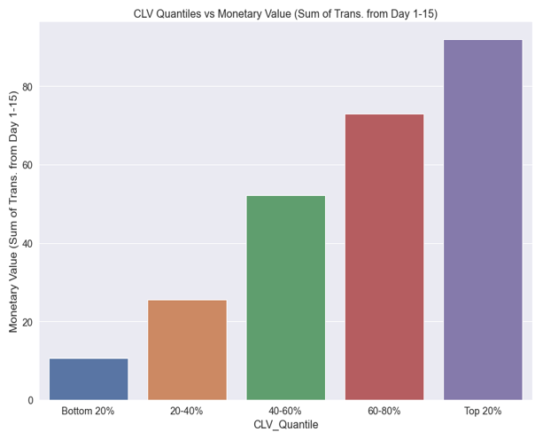
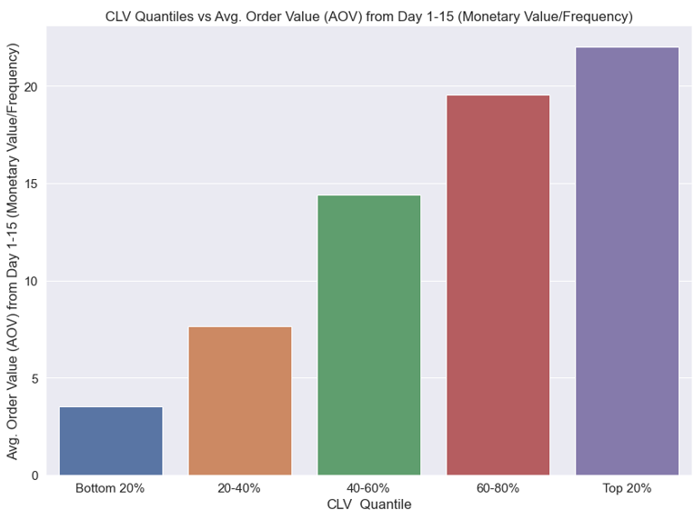
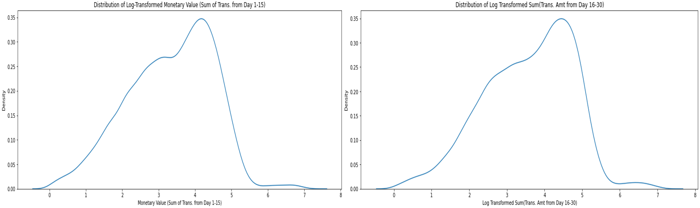
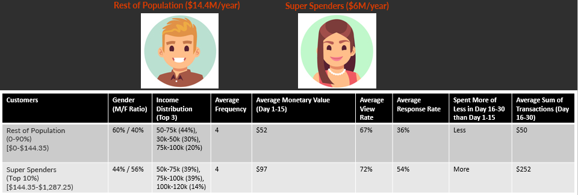

<h2 align="center"> Segmenting High Value Customers with Predictive CLV </h2>

<h3 align="center"> Introduction </h3>

Imagine having the ability to precisely quantify the value of different customer segments to a business. This concept isn't just philosophical; it is a well-researched and important aspect of modern, data-driven marketing strategy. Companies make significant investments of time and resources into  acquiring and retaining customers. A data-driven approach empowers them to make more informed decisions, prioritizing strategies with the highest returns on investment.

In this capstone project, Customer Lifetime Value (CLV) is predicted on an individual (customer-by-customer) basis to identify valuable customers for retention and upselling. This analysis will also dive into notable trends of the behaviors and demographics of the top 10% of customers. The goal is to optimize marketing strategies and maximize profitability using predictive CLV.

<h3 align="center"> Data Overview, Imputation, and Transformation </h3>

The Starbucks reward offers dataset from Kaggle simulates the Starbucks Reward Program, consisting of 76,277 marketing offers sent to 17,000 users over 30 days. The dataset includes three tables: an event log tracking user actions, customer profiles with demographic information, and marketing offers sent through various channels.

To construct the CLV dataset, the original data was divided into two equal 15-day periods. The first period's demographic, behaviors, and spending data were used to predict spending in the latter period. CLV is calculated as the sum of transactions during the latter period and segmented into five quantiles. Quantiles are statistical measures that divide a dataset into 5 equal segments, representing different customer groups based on value.

Assigning each customer to a CLV quantile makes it possible to analyze customer attributes and behaviors by quantile and to compare the typical customer profile across quantiles. Factors evaluated when predicting future customer value included included activity measures such as Recency, Frequency, Monetary, Average Order Value (AOV), Response Rate, View Rate, and Completed Offers by Channel, along with customer attributes like age, gender, household income, and membership year. 

<h3 align="center"> Insights </h3>

Let's explore some intriguing insights that this data can reveal about the rewards program and its customer base.

<b>The top 20% of the most valuable customers spend an average of $6 per day, equivalent to the cost of one specialty drink. </b>Marketers use RFM (Recency, Frequency, and Monetary) analysis to segment customers. Interestingly, there is little disparity in Recency or Frequency between the highest and lowest value segments, possibly due to the nature of the product being coffee, which is purchased regularly, and the short duration of the measurement period (15 days). For instance, the top 80% of customers (by value) visited Starbucks four times within 15 days.

However, a significant difference was observed in the transaction amount. <b>The top 20% of customers spend approximately $22 per visit, while the bottom 20% spend only $3.50 per visit on average!</b> To put this into perspective, $3.50 is equivalent to the cost of one bakery item, whereas $22 covers three specialty items like a sandwich, protein box, and specialty drink. The difference in Average Order Value (AOV) is the key factor driving the difference in total spending between these customer segments.

<b>Response Rate shows a strong correlation with CLV, with a substantial 45% difference between the top and bottom quantiles (54% vs. 9%, respectively).</b> Although customers were equally likely to view marketing offers regardless of their total spend amount, higher value customers are more likely to respond to the marketing offers. This emphasizes response rate as a key metric for measuring customer engagement.

<b>CLV is highly right-skewed, with some customers spending $1.2K-$1.3K in 15 days.</b>  The average customer spent $50 over 15 days.  In contrast, the highest spender from day 1-15 spent ~$600 per visit in two visits, and the highest spender from day 16-30 spent ~$500-600 per visit in two visits, indicating potential corporate card usage for group orders.

To address this skew, applying Log transformation to the Monetary Value feature and the Target Variable can potentially improve model fit and reduce prediction errors (measured by MAE) by reducing skewness and normalizing the distribution.

<h3 align="center"> Customer Profiles </h3>

Let's introduce customer profiles based on their spending quantiles: Occasional Buyers, Casual Shoppers, Regular Patrons, Engaged Members, and Top Spenders. Customer profiles provide detailed representations of customers' demographic information, purchasing behavior, interests, and preferences.

Contrastings spending patterns and ranges:

- There is significant spending variation between Top Spenders ($107.86-$1,287.25) vs. Occasional Buyers ($0-$14.65).
- $50k-75k is the most common income range among all customers.
- The average frequency is ~4 visits in 15 days for all quantiles.
- The Average Monetary Value increases with quantile (Top Spenders: $92 spent in 15 days).
- The marketing offer view rate is relatively consistent, but response rate increases as customer value increases.
- The Engaged Members and Top Spenders increased average spending from Days 16-30.

These insights inform targeted marketing and loyalty efforts, boosting satisfaction and loyalty across spending levels.

Now let’s compare the Top 10% vs the Rest of the Population and what are the most striking differences between them.

- Spending Amount: Super Spenders consistently spend significantly more than the Rest of the Population throughout the month. Their average sum of transactions in the second half is $252, compared to $50 for the Rest of the Population.
- Response Rate: Super Spenders have a higher response rate (54%) compared to the Rest of the Population (36%), indicating potentially higher engagement or satisfaction.
- Gender Distribution: Super Spenders have a higher proportion of females (56%) compared to the Rest of the Population (40%), suggesting possible gender-based spending patterns.
- Income Distribution: Super Spenders have more individuals with higher incomes ($75k and above), suggesting that disposable income influences spending patterns.
- Frequency of Transactions: Both groups have the same average transaction frequency, highlighting the importance of increasing AOV.
 
To leverage these insights effectively, one recommendation is to incorporate gender-based marketing approaches. Another recommendation is to focus on increasing AOV rather than increasing transaction frequency.

<h3 align="center">Benefits of Predictive CLV</h3>

Let's take a moment to revisit the business value from  predictive CLV. Predictive CLV enables strategic resource allocation, focusing on high-value customers for optimized marketing and retention efforts. It facilitates effective customer segmentation, leading to personalized experiences and increased customer satisfaction. By estimating potential customer value, businesses can optimize customer acquisition and retention spending to improve ROI. Predictive CLV also provides insights into future revenue generation, aiding in informed growth planning. Furthermore, it enhances customer relationship management with personalized offers and a deeper understanding of customer preferences and behaviors.

<h3 align="center">Model Comparisons</h3>

After comparing different models with various feature sets determined by feature importance, LGBM emerged as the winner using the full feature set. LGBM (Light Gradient Boosting Machine) is an efficient machine learning algorithm that utilizes gradient boosting to build predictive models. It is known for its high speed, low memory usage, and strong performance on large-scale datasets. Feature importance analysis helped identify relevant predictors for the model. Note that Average Order Value (AOV) and offers completed by channel features were dropped upfront to reduce multicollinearity. LGBM performed well in terms of minimizing MAE (Mean Absolute Error), which measures the average absolute difference between the predicted values and the actual values.

During model comparisons, after performing a 70/30 train-test split, a KFold cross-validation strategy with 5 folds was implemented, randomly shuffling the records. Then MAE values were analyzed using boxplots for both the training and test data. LGBM minimized Test MAE and maintained a consistently lower and narrower MAE range in K-fold cross-validation, demonstrating model stability. The winning model then underwent hyperparameter tuning with RandomSearchCV.

LGBM Feature Importance highlights Monetary Value and Frequency as the most important features. 

Note: Monetary Value / Frequency also equals Average Order Value (AOV)!

An example of one LGBM Tree Split analyzes Spending, HH Income, Frequency in its initial branches, identifying influential predictors. This is consistent with feature importance. Initial splits capture important predictors. By considering these key features early on, the algorithm can identify the most relevant variables and create a strong foundation for subsequent splits. This approach allows for more efficient decision-making, potentially leading to improved predictions and model performance.

The winning model, LGBM without log transformation, delivers the best predictions for Regular Patrons (60-80% Quantile) but faces challenges due to skewness. It tends to overestimate CLV for the bottom 80% and underestimate for the top 20%. This skew is a result of the uneven distribution of customers, with a higher concentration of lower-spending customers and relatively fewer high-spending customers. Consequently, the tree model struggles to identify meaningful patterns or splits specific to the relatively fewer high-value customers, impacting its ability to accurately capture their behaviors. As a result, the model has difficulty predicting the lowest or highest value customers.

When drilling into the predictions, it becomes evident that this model consistently underestimates the CLV for Super Spenders (Top 10% with Actual CLV of $144+) due to right-skew in the data distribution.

<h3 align="center">Preprocessing Variants Tested with LGBM Model </h3>

A preprocessing variation was tested, capping transaction amounts in the Monetary Feature and Target Variable Column at 95%. Capped values were imputed with their corresponding 95th percentile values. The new model demonstrated improved predictions for the Bottom 60% segment, resulting in better MAE and MAPE scores.

After testing another preprocessing variation, which involved applying a Log Transformation to both the Monetary Feature & Target Variable, it was found that this transformation did not improve predictions for high-value segments. Although the log transformation reduced the variability in error metrics for the Bottom 60% of customers and improved predictions for this segment, it was less effective in predicting the Top 40% or high-value customers. As a result, the log transformation did not improve predictions for high value segments.

In the final preprocessing variation, both a 95% Cap and Log Transformation were applied to the Monetary Value & Target Variable. Like the previous test, the log transformation reduced the variability in error metrics for the Bottom 40% of customers and improved predictions for this segment. However, despite applying both a 95% Cap and Log Transformation to the Monetary Value & Target Variable, high-value segment predictions did not improve.

After experimenting with various preprocessing steps using an LGBM model to improve model fit, let's consider another perspective: Is modeling necessary for improving predictions? After comparing the transactions between the first 15 days and the last 15 days across segments, it was found that while past spending alone serves as a good indicator for segmenting users based on CLV, incorporating the full feature set in predictive CLV yields slightly better predictions.

<h3 align="center">Insights and Actionable Recommendation</h3>

The analysis and model predictions indicates four key recommendations:

1. The best method to improve predictions was using a hyper-parameter tuned LGBM model without log transformation.

2. Addressing the right skew in the data is challenging.  A log transformation was tested on the Monetary Value and Target Variable and successfully reduced variability in error metrics, improving predictions for the bottom 60% of customers. However, it had difficulty  predicting the top 40%. Therefore, the log transformation did not assist in predicting high-value segments with this dataset. It's worth noting that the dataset has limitations, as CLV is usually measured over a longer time horizon or with a richer set of features.

3. While past spend appears to be a good signal for future spend to segment users on CLV, we can get a slightly better result by including the full feature set. Utilizing predictive modeling is the preferred approach for CLV segmentation.

4. Since the average frequency of purchases is similar between the top 10% and the rest of the population, it is recommended to focus on strategies that increase the amount spent per transaction (Average Order Value) rather than the number of transactions. 

<h3 align="center">Future Work</h3>

Looking ahead, these data science and analytics projects present pathways for the business to flourish and achieve its goals.
 
1. Starbucks Diamond Loyalty Program: Implement a tailored loyalty program, "Starbucks Diamond," specifically designed for "super spenders" in the top 10% of CLV. As a short-term strategy, include customers spending $200 or more per month. For the long-term, identify potential upgraders by approaching it as a binary classification problem, focusing on users displaying behaviors indicating their likelihood to upgrade. Identifying and retaining high-value customers is often more cost-effective than acquiring new ones.

2. Prioritize Regular Patrons for Retention: Since the LGBM model without preprocessing (without 95% Cap or Log Transformation) predicts the Regular Patrons (60-80% Quantile) segment the best with the lowest errors, concentrate on encouraging these customers to transition into higher-value segments. Engaged Members and Top Spenders segments exhibit strong response rates and spending habits, requiring less attention in terms of retention efforts.

3.  Utilize K-Means Clustering for Customer Segments: Employ K-Means Clustering to create customer segment models, unveiling additional patterns about customers for personalized experiences and targeted communications. This approach allows businesses to focus on valuable segments and allocate resources effectively.

<h3 align="center">Summary</h3>

By embracing the power of predictive CLV, businesses can make informed decisions, optimize resource allocation, and strengthen customer relationships. Continuous refinement of predictive models ensures competitiveness and long-term success in a dynamic market. By adopting this approach, businesses can open up fresh opportunities for customer engagement, retention, and expansion, catalyzing future growth and nurturing innovation.
 

